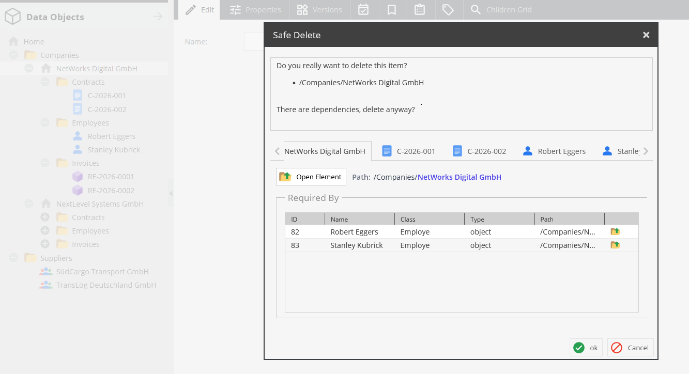
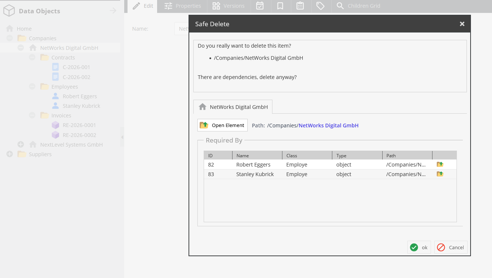
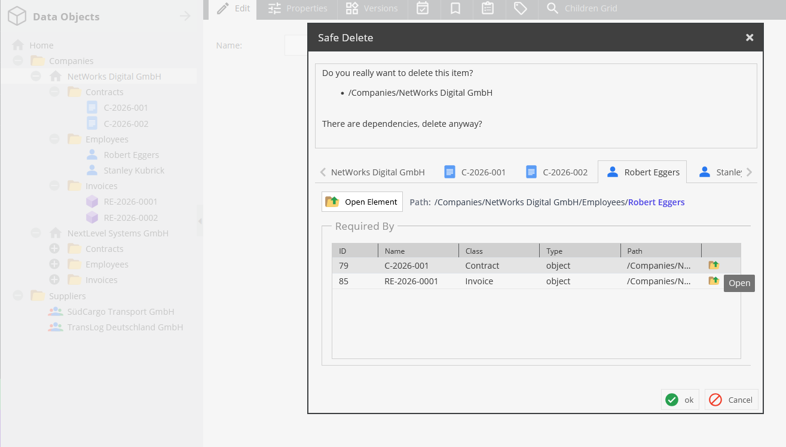
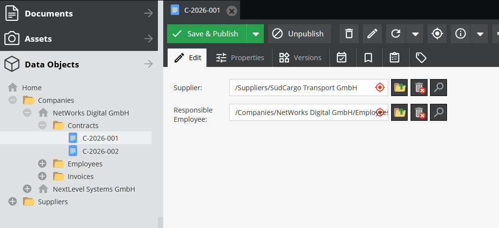
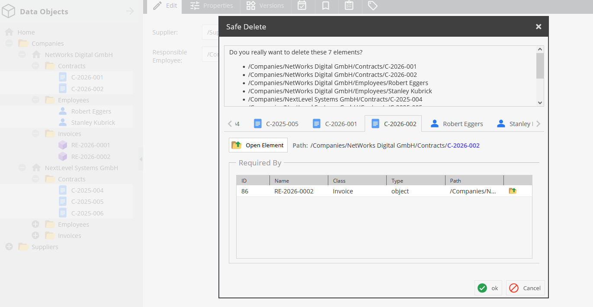

# Pimcore Safe Delete Bundle

The **Pimcore Safe Delete Bundle** extends Pimcore's existing delete functionality.

When deleting Pimcore elements, the bundle checks whether dependencies to other elements exist. If dependencies are found, a **Safe Delete modal** is displayed, listing the affected elements and their dependencies.

The listed dependencies can be opened in a **new browser tab**. When opened in a new tab, the Pimcore tree is automatically expanded up to the corresponding element.

## Features

- Extends Pimcore's existing delete functionality
- Displays detected dependencies in a dedicated modal
- Optionally includes child and descendant elements when checking dependencies (enabled by default)
- Dependencies can be opened in a new browser tab
- When opened in a new tab, the Pimcore tree is automatically expanded up to the corresponding element

## Installation

### 1. Add the repository

The bundle is installed through a VCS repository.

Add the following repository to the `composer.json` of your Pimcore project:

```json
"repositories": [
    {
        "type": "vcs",
        "url": "git@github.com:girgl773/pimcore-safe-delete-bundle.git"
    }
]
```

### 2. Install the bundle

Install the bundle using Composer:

```bash
composer require factotum/safe-delete-bundle:dev-master
```

### 3. Register the bundle

After installing the bundle, register it in `config/bundles.php`:

```php
// ...
use Factotum\SafeDeleteBundle\SafeDeleteBundle;

return [
    // ...
    SafeDeleteBundle::class => ['all' => true]
];
```

### 4. Install the assets

After registering the bundle, install its assets:

```bash
bin/console assets:install
```

### 5. Clear the Cache

After completing the changes, clear the cache:

```bash
bin/console cache:clear
bin/console pimcore:cache:clear
```

## Configuration

The bundle provides a configuration option that controls whether descendants of selected elements are also checked for dependencies.

Example:

```yaml
factotum_safe_delete:
    include_children: true
```

### `include_children`

| Value | Behavior |
|-------|----------|
| `true` | When an element is selected, its children and further descendants are also checked for dependencies. |
| `false` | Only the selected element itself is checked for dependencies. |

For example, with:

```yaml
factotum_safe_delete:
    include_children: true
```

selecting a parent element causes the parent itself as well as its child and descendant elements to be included in the dependency check.

With:

```yaml
factotum_safe_delete:
    include_children: false
```

only the selected element is checked.


## Usage

The bundle extends Pimcore's existing delete functionality, so no additional user interaction is required.

When an element with dependencies is about to be deleted, the Safe Delete modal is displayed:

The modal lists the elements involved and their dependencies.

Dependencies can be opened in a new browser tab.

### Select a parent element – `include_children: true`

When `include_children` is enabled, selecting a parent element also includes its children and further descendants in the dependency check.



### Select a parent element – `include_children: false`

When `include_children` is disabled, only the selected parent element itself is checked for dependencies.



### Open a dependency in a new tab

A dependency can also be opened in a new browser tab.



The Pimcore tree is automatically expanded up to the corresponding element, so the opened element is immediately visible in its context within the Object Tree.



### Select individual elements

Of course, it is also possible to select individual elements from different parent elements.



## TODO / Development Status

The bundle is currently under development.

At the moment, the Safe Delete functionality is available for Data Objects. Support for Assets and Documents is currently being implemented and will be added accordingly.
